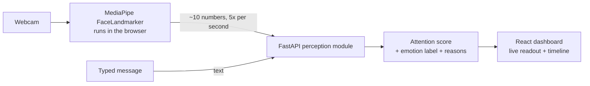

# CogniLearn: Emotion-Aware Adaptive Study Companion

A cognitive computing project that perceives how a learner is doing, reasons about it, and adapts. It watches attention and emotion through the webcam, understands the learner's notes, and chooses the next teaching step.

**Live demo:** https://cognilearn-psi.vercel.app/
**API:** https://cognilearn-ckg3.onrender.com ([health check](https://cognilearn-ckg3.onrender.com/health) · [interactive docs](https://cognilearn-ckg3.onrender.com/docs))

> The backend runs on a free Render instance that sleeps after 15 minutes idle. If the demo shows an error on first load, open the health check link, wait about a minute, then refresh.

<!-- Add a screenshot or GIF: docs/demo.gif, then uncomment the next line -->
<!--  -->

## Why cognitive computing?

Cognitive computing systems imitate human thought processes. CogniLearn is built around that loop:

| Stage | What CogniLearn does | Status |
|---|---|---|
| Perceive | Reads attention and emotion from facial signals; scores text sentiment | Done |
| Understand | Turns study notes into searchable knowledge (RAG + concept graph) | Planned |
| Reason and learn | Picks the next teaching action with a bandit policy | Planned |
| Explain | Shows why each decision was made | Partly done (reasons for each emotion label) |

## What works today

- Live webcam analysis in the browser using MediaPipe FaceLandmarker.
- A smoothed attention score (0-100%) from head pose and eye closure.
- An emotion label (engaged, confused, bored, happy, away) with the reasons behind it.
- A rolling focus timeline.
- Text tone check (keyword-based by default, DistilBERT optional).

## Architecture



Video never leaves the browser. Only numeric face features are sent to the backend.

## Tech stack

- **Frontend:** React 18, Vite, MediaPipe Tasks Vision
- **Backend:** Python, FastAPI, Pydantic
- **Optional NLP:** Hugging Face Transformers (DistilBERT)
- **Hosting:** Vercel (frontend), Render (backend)

## How the perception module works

The browser extracts blendshape scores (blink, smile, brow, jaw) and head pose (yaw, pitch) from each video frame. The backend then:

1. **Attention:** starts at 1.0 and subtracts penalties for head turn (beyond 15 degrees), head tilt, and closed eyes. The result is smoothed with an exponential moving average.
2. **Emotion:** applies transparent rules, in order: smile gives *happy*, furrowed or raised brows give *confused*, low attention or closed eyes give *bored*, high attention with a relaxed face gives *engaged*.
3. **Explainability:** every label returns the evidence that triggered it.

The rules are deliberately simple and inspectable. A later step compares them against a learned model.

## API

| Method | Endpoint | Purpose |
|---|---|---|
| GET | `/health` | Service status |
| POST | `/api/perception/analyze` | Face features in, attention and emotion out |
| GET | `/api/perception/history/{session_id}` | Recent readings for a session |
| POST | `/api/perception/text` | Sentiment of a typed message |

Example:

```bash
curl -X POST https://cognilearn-ckg3.onrender.com/api/perception/analyze \
  -H "Content-Type: application/json" \
  -d '{"session_id":"demo","yaw":2,"pitch":1,"smile":0.1}'
```

## Run locally

**Backend**
```bash
cd backend
python3 -m venv .venv && source .venv/bin/activate
pip install -r requirements.txt
python -m uvicorn app.main:app --reload --port 8000
```

**Frontend** (new terminal)
```bash
cd frontend
npm install
npm run dev
```

Open http://localhost:5173 and allow camera access.

**Tests**
```bash
cd backend && pip install pytest && pytest
```

**Optional: better text sentiment**
```bash
pip install transformers torch
COGNILEARN_USE_TRANSFORMERS=1 python -m uvicorn app.main:app --reload --port 8000
```

## Deploy

- **Backend (Render):** root directory `backend`, build `pip install -r requirements.txt`, start `uvicorn app.main:app --host 0.0.0.0 --port $PORT`.
- **Frontend (Vercel):** root directory `frontend`, environment variable `VITE_API_URL` set to the Render URL (no trailing slash).
- **CORS:** the backend allows `localhost` and any `https://cognilearn*.vercel.app` URL. For a custom domain, set `ALLOWED_ORIGINS` on Render.

## Privacy

- Camera video is processed locally in the browser and never uploaded or stored.
- Only about ten numeric features are sent per reading, tied to a random session ID.
- Emotion and attention estimates are approximate and meant for adapting a study session, not for judging a person.

## Roadmap

- [x] Perception module: attention, emotion, text sentiment
- [x] Deployed frontend and backend
- [ ] Knowledge module: PDF upload, chunking, FAISS retrieval, concept graph
- [ ] Adaptation engine: Thompson-sampling bandit choosing the next teaching action
- [ ] Explainability dashboard: mastery graph and "why this suggestion?" panel
- [ ] Evaluation: emotion accuracy on FER2013, RAG hit rate, bandit vs random baseline
- [ ] AR/VR extension: 3D focus heatmap or avatar tutor

## Author

- GitHub: [Kailashaghav](https://github.com/Kailashaghav)
- Portfolio: [kailashaghavportfolio.vercel.app](https://kailashaghavportfolio.vercel.app)
- LinkedIn: [kailash-aghav4](https://linkedin.com/in/kailash-aghav4)
